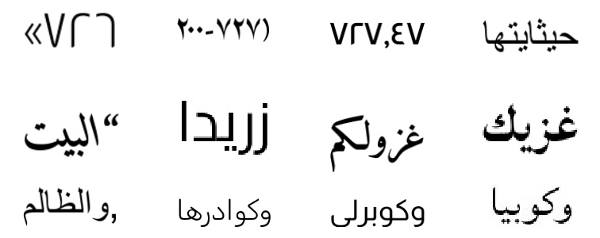
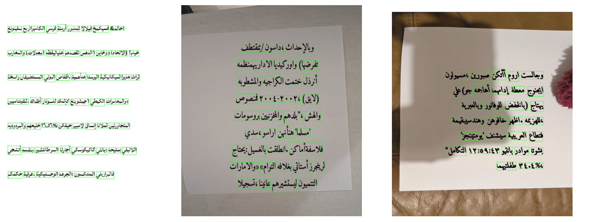

## Modified SynthTIGER for docTR

This fork is intended to be used for generating synthetic text images for detection and recognition tasks, mainly to use with [docTR](https://github.com/mindee/doctr).

List of changes compared to the original repository:

- Updated the original code for compatibility with Python 3.10 and fixed `numpy` and `pillow` versions to prevent dependency conflicts.
- Implemented a new Corpus class to sample words deterministically from the prepared corpus file.
- Developed a new Fit class to enable the generation of multi-line text images with associated polygon coordinates.
- Utilised NumPy broadcasting to evaluate text visibility, significantly accelerating the generation process.
- Removed specific blend modes that resulted in illegible or invisible rendered text.
- New templates and configuration files to produce synthetic images tailored for docTR model training.
- Integrated tools for cleaning Arabic corpus files and converting output data into the requisite docTR format.
- Curated and uploaded additional texture images to enhance data augmentation for the text detection task.

Compatible with Python 3.10. Follow the next steps to set up the environment and install the library (don't install the library from PyPI or using the original repository instructions, install it from this source code):

```
git clone git@github.com:tarekio/synthtiger.git
cd synthtiger
python -m venv .venv # or python3.10 -m venv .venv 
source .venv/bin/activate
pip install . # or python3.10 -m pip install .
```
### Corpus

You need to replace corpus file `resources/corpus/corpus.txt` with your own corpus file. The format of the corpus file is one word per line. You can get free corpora from [Leipzig Corpora Collection](https://wortschatz-leipzig.de/en). `tools/clean_arabic_sentences.py` and `tools/process_txt.py` can be used for cleaning and processing Arabic corpus files. Feel free to edit to suit your needs/language.

### Fonts

You should also add your own font files in `resources/font` directory, if needed. You can get free fonts from [Google Fonts](https://fonts.google.com/). Check the original readme below for more details on adding custom fonts.

### Recognition

To generate synthetic text images for recognition task, run the following command.

```
synthtiger -o reco -c 10 -w 2 -v templates/reco.py Reco templates/reco.yaml # c is the number of images to generate, w is the number of workers.
```

Check the template and config files for more details. The existing template will generate single word images, going through the corpus file line by line from the beginning. To change this behavior, you can edit the template file `templates/reco.py` and replace the corpus class with the original `BaseCorpus`.

Another point to note is that the template doesn't apply any augmentation, it just generates clean text images. You can add augmentations in the template file if you want, or you can apply augmentations later in the training pipeline. 

Here are examples of generated images for recognition task:



The generated data will be saved in `reco` directory using the default structure outlined below.

Once you're done, you can convert the generated data to the format docTR expects:

```
python tools/gt_to_json.py reco/gt.txt /path/to/dataset/
```

### Detection

To generate synthetic text images for detection task, run the following command.

```
synthtiger -o detect -c 10 -w 2 -v templates/detect.py Detect templates/detect.yaml
```

Check the template and config files for more details. The existing template will generate multi-line text images, going through the corpus file randomly. The template will save polygon coordinates of each word, rather than each character as the original repository does. 

The template applies texture augmentation and post-processing, but doesn't apply any transformation augmentation. You can add uncomment transforms in the template and config files if you want, or you can apply augmentations later in the training pipeline.

The images will contain background textures from `resources/images_pics` directory, with the aim of generating realistic images of documents taken by mobile phones. You can change the texture images or add more texture images. You can also add scanned document images from `resources/images_scan` directory. Check FUNSD dataset for examples of scanned document images. 

Here are examples of generated images for detection task with polygon annotations in green:



The generated data will be saved in `detect` directory using the default structure outlined below. 

`coords.txt` will contain file path, image size and polygon coordinates of each word in the generated images. 

Once you're done, you can convert the generated data to the format docTR expects:

```python tools/coord_to_json.py detect /path/to/dataset/```


Below is the original readme from the repository, which contains more details on the usage of the library and how to customize it for your needs.

<div align="center">

# SynthTIGER 🐯 : Synthetic Text Image Generator

[](https://pypi.org/project/synthtiger/)
[](https://github.com/clovaai/synthtiger/actions/workflows/ci.yml)
[](https://github.com/clovaai/synthtiger/actions/workflows/docs.yml)
[](LICENSE)
[](https://github.com/psf/black)

Synthetic Text Image Generator for OCR Model | [Paper](https://arxiv.org/abs/2107.09313) | [Documentation](https://clovaai.github.io/synthtiger/) | [Datasets](#datasets)

</div>


## Contents

- [Documentation](#documentation)
- [Installation](#installation)
- [Usage](#usage)
- [Advanced Usage](#advanced-usage)
- [Datasets](#datasets)
- [Citation](#citation)
- [License](#license)

## Documentation

The documentation is available at <https://clovaai.github.io/synthtiger/>.

You can check API reference in this documentation.

## Installation

SynthTIGER requires `python>=3.6` and `libraqm`.

To install SynthTIGER from PyPI:

```bash
$ pip install synthtiger
```

If you see a dependency error when you install or run SynthTIGER, install [dependencies](depends).

## Usage

```bash
# Set environment variable (for macOS)
$ export OBJC_DISABLE_INITIALIZE_FORK_SAFETY=YES
```

```
usage: synthtiger [-h] [-o DIR] [-c NUM] [-w NUM] [-s NUM] [-v] SCRIPT NAME [CONFIG]

positional arguments:
  SCRIPT                Script file path.
  NAME                  Template class name.
  CONFIG                Config file path.

optional arguments:
  -h, --help            show this help message and exit
  -o DIR, --output DIR  Directory path to save data.
  -c NUM, --count NUM   Number of output data. [default: 100]
  -w NUM, --worker NUM  Number of workers. If 0, It generates data in the main process. [default: 0]
  -s NUM, --seed NUM    Random seed. [default: None]
  -v, --verbose         Print error messages while generating data.
```

### Examples

#### SynthTIGER text images

```bash
# horizontal
synthtiger -o results -w 4 -v examples/synthtiger/template.py SynthTiger examples/synthtiger/config_horizontal.yaml

# vertical
synthtiger -o results -w 4 -v examples/synthtiger/template.py SynthTiger examples/synthtiger/config_vertical.yaml
```

<p>
    
    
</p>

- `images`: a directory containing images.
- `gt.txt`: a file containing text labels.
- `coords.txt`: a file containing bounding boxes of characters with text effect.
- `glyph_coords.txt`: a file containing bounding boxes of characters without text effect.
- `masks`: a directory containing mask images with text effect.
- `glyph_masks`: a directory containing mask images without text effect.

#### Multiline text images

```bash
synthtiger -o results -w 4 -v examples/multiline/template.py Multiline examples/multiline/config.yaml
```


- `images`: a directory containing images.
- `gt.txt`: a file containing text labels.

## Advanced Usage

### Non-Latin language data generation


1. Prepare corpus

   `txt` format, line by line ([example](resources/corpus/mjsynth.txt)).

2. Prepare fonts

   See [font customization](#font-customization) for more details.

3. Edit corpus path and font path in config file ([example](examples/synthtiger/config_horizontal.yaml))

4. Run synthtiger

### Font customization

1. Prepare fonts

   `ttf`/`otf` format ([example](resources/font)).

2. Extract renderable charsets

   ```bash
   python tools/extract_font_charset.py -w 4 fonts/
   ```

   This script extracts renderable charsets for all font files ([example](resources/font/Ubuntu-Regular.txt)).

   Text files are generated in the input path with the same names as the fonts.

3. Edit font path in config file ([example](examples/synthtiger/config_horizontal.yaml))

4. Run synthtiger

### Colormap customization

1. Prepare images

   `jpg`/`jpeg`/`png`/`bmp` format.

2. Create colormaps

   ```bash
   python tools/create_colormap.py --max_k 3 -w 4 images/ colormap.txt
   ```

   This script creates colormaps for all image files ([example](resources/colormap/iiit5k_gray.txt)).

3. Edit colormap path in config file ([example](examples/synthtiger/config_horizontal.yaml))

4. Run synthtiger

### Template customization

You can implement custom templates by inheriting the base template.

```python
from synthtiger import templates


class MyTemplate(templates.Template):
    def __init__(self, config=None):
        # initialize template.

    def generate(self):
        # generate data.

    def init_save(self, root):
        # initialize something before save.

    def save(self, root, data, idx):
        # save data to specific path.

    def end_save(self, root):
        # finalize something after save.
```

## Datasets

SynthTIGER is available for download at [google drive](https://drive.google.com/drive/folders/1faHxo6gVeUmmFKJf8dxFZf_yRjamUL96?usp=sharing).

Dataset was split into several smaller files. Please download all files and run following command.

```bash
# for Linux, macOS
cat synthtiger_v1.0.zip.* > synthtiger_v1.0.zip

# for Windows
copy /b synthtiger_v1.0.zip.* synthtiger_v1.0.zip
```

**synthtiger_v1.0.zip** (36G) (md5: 5b5365f4fe15de24e403a9256079be70)

- Original paper version.
  - Used MJ and ST label.

**synthtiger_v1.1.zip** (38G) (md5: b2757a7e2b5040b14ed64c473533b592)

- Used MJ and ST lexicon instead of MJ and ST label.
  - [resources/corpus/mjsynth.txt](resources/corpus/mjsynth.txt)
  - [resources/corpus/synthtext.txt](resources/corpus/synthtext.txt)
- Fixed a bug that applies transformation twice on curved text.
- Fixed a bug that incorrectly converts grayscale to RGB.

| Version | IIIT5k | SVT | IC03 | IC13 | IC15 | SVTP | CUTE80 | Total |
| ------- | ------ | --- | ---- | ---- | ---- | ---- | ------ | ----- |
| 1.0 | 93.2 | 87.3 | 90.5 | 92.9 | 72.1 | 77.7 | 80.6 | 85.9 |
| 1.1 | 93.4 | 87.6 | 91.4 | 93.2 | 73.9 | 77.8 | 80.6 | 86.6 |

### Structure

The structure of the dataset is as follows. The dataset contains 10M images.

```
gt.txt
images/
    0/
        0.jpg
        1.jpg
        ...
        9998.jpg
        9999.jpg
    1/
    ...
    998/
    999/
```

The format of `gt.txt` is as follows. Image path and label are separated by tab. (`<image_path>\t<label>`)

```
images/0/0.jpg	10
images/0/1.jpg	date:
...
images/999/9999998.jpg	STUFFIER
images/999/9999999.jpg	Re:
```

## Citation

```bibtex
@inproceedings{yim2021synthtiger,
  title={SynthTIGER: Synthetic Text Image GEneratoR Towards Better Text Recognition Models},
  author={Yim, Moonbin and Kim, Yoonsik and Cho, Han-Cheol and Park, Sungrae},
  booktitle={International Conference on Document Analysis and Recognition},
  pages={109--124},
  year={2021},
  organization={Springer}
}
```

## License

```
SynthTIGER
Copyright (c) 2021-present NAVER Corp.

Permission is hereby granted, free of charge, to any person obtaining a copy
of this software and associated documentation files (the "Software"), to deal
in the Software without restriction, including without limitation the rights
to use, copy, modify, merge, publish, distribute, sublicense, and/or sell
copies of the Software, and to permit persons to whom the Software is
furnished to do so, subject to the following conditions:

The above copyright notice and this permission notice shall be included in
all copies or substantial portions of the Software.

THE SOFTWARE IS PROVIDED "AS IS", WITHOUT WARRANTY OF ANY KIND, EXPRESS OR
IMPLIED, INCLUDING BUT NOT LIMITED TO THE WARRANTIES OF MERCHANTABILITY,
FITNESS FOR A PARTICULAR PURPOSE AND NONINFRINGEMENT.  IN NO EVENT SHALL THE
AUTHORS OR COPYRIGHT HOLDERS BE LIABLE FOR ANY CLAIM, DAMAGES OR OTHER
LIABILITY, WHETHER IN AN ACTION OF CONTRACT, TORT OR OTHERWISE, ARISING FROM,
OUT OF OR IN CONNECTION WITH THE SOFTWARE OR THE USE OR OTHER DEALINGS IN
THE SOFTWARE.
```

The following directories and their subdirectories are licensed the same as their origins. Please refer to [NOTICE](NOTICE)

```
docs/
resources/font/
```
